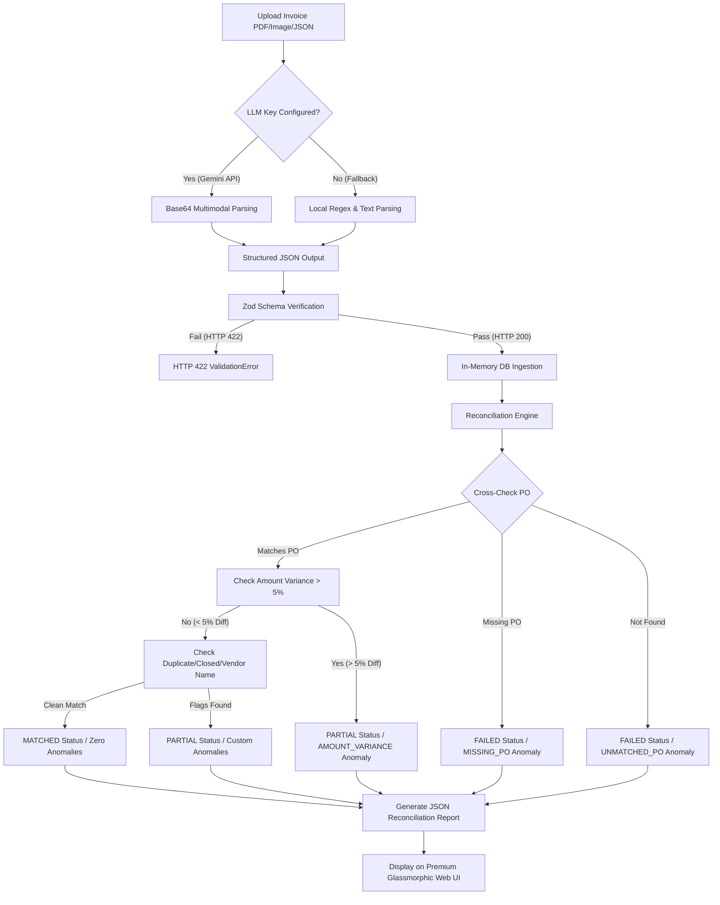

# 🧾 Intelligent Invoice Processing & Reconciliation Agent
[](https://fin-flow-agent-64y1qkpgn-abhinay-s-projects3.vercel.app/)
[](https://nodejs.org/)
[](https://expressjs.com/)
[](https://zod.dev/)
[](https://jestjs.io/)
[](https://deepmind.google/technologies/gemini/)

🔗 **Live Deployment**: [fin-flow-agent.vercel.app](https://fin-flow-agent-64y1qkpgn-abhinay-s-projects3.vercel.app/)

An advanced, production-ready accounts-payable AI agent built on **Node.js** and **Express.js** to ingest vendor invoices (via PDF/text/image uploads or raw JSON payloads), extract key fields using multimodal LLMs, validate them structurally, match them against Purchase Orders (POs), flag anomalies dynamically, and return structured JSON reconciliation reports.

Features a **premium, glassmorphic dark-mode web dashboard** for interactive visual testing, drag-and-drop file upload, monospaced JSON viewer, and side-by-side reconciliation comparison reports.

---

## 🏗️ High-Level Technical Architecture



---

## 🌟 Core Capabilities

*   **Multimodal Visual Parsing (Gemini 2.5-flash)**: Accepts raw PDF binaries and image buffers directly. Gemini visually reads grid lines, complex multi-column layouts, shipping blocks, and line item tables, eliminating text-extraction errors.
*   **Strict JSON Outlining (Gemini responseSchema)**: Leverages Gemini's official structured outputs schema configuration. This guarantees that the LLM structure is formatted perfectly for our Express backend before Zod validation runs.
*   **Built-in Local Regex Parsing Engine**: Runs fully offline if no LLM API key is specified. Parses incoming plain-text file buffers and PDF text using flexible regular expression patterns.
*   **Robust Date & Currency Normalization**: Automatic date normalizer intercepts formats like `DD.MM.YYYY`, `DD/MM/YYYY`, or standard localized dates and converts them into strict ISO `YYYY-MM-DD` strings. Commas in values (e.g. `1,299.00`) and currency symbols (e.g. `₹`, `$`) are stripped and parsed to compliant floats and 3-letter currency ISO codes (e.g. `INR`, `USD`).
*   **Transactional Duplicate Detection**: Maintains session maps of all processed invoice numbers. Submitting the same invoice number again automatically tags the invoice with a `DUPLICATE_INVOICE` anomaly and links it back to the original `invoice_id`.

---

## 📁 Directory Structure

```text
invoice-processing-agent/
├── package.json          # Project specifications and dependencies
├── .env                  # Environment configurations (Port, LLM Keys)
├── README.md             # GitHub documentation (this file)
├── invoice.pdf           # Sample real-world Amazon invoice for testing
├── test-extraction.js    # Utility script to test Gemini API directly
├── public/
│   ├── index.html        # Premium UI HTML markup (Glassmorphic)
│   └── index.css         # Custom responsive Dark Mode HSL styling
├── src/
│   ├── index.js          # Node server entry point
│   ├── app.js            # Middleware, static routing & error boundary configurations
│   ├── config.js         # Settings, environment, and PO seed data
│   ├── controllers/
│   │   └── invoice.controller.js  # Request/response controllers
│   ├── routes/
│   │   └── invoice.routes.js      # Endpoint route bindings
│   ├── services/
│   │   ├── db.service.js          # In-memory database & transaction indices
│   │   ├── llm.service.js         # Gemini API / OpenAI API / Regex parser controller
│   │   ├── validation.service.js  # Zod schema definitions and structural checks
│   │   ├── po.service.js          # Deterministic Purchase Order matching
│   │   └── reconciliation.service.js # Reconciliation rules engine & anomaly detector
│   └── utils/
│       ├── logger.js     # Winston logging configurations
│       └── errors.js     # Centralized operational error middleware
└── tests/
    └── invoice.test.js   # Automated integration test suite (10 scenarios)
```

---

## 🚀 Quick Start Setup

### 1. Pre-requisites
Ensure you have [Node.js (v18+)](https://nodejs.org/) installed on your machine.

### 2. Install Dependencies
Clone this repository to your local directory and run:
```bash
npm install
```

### 3. Configure API Keys & Port
Open the `.env` file at the root of the project:
```env
PORT=3000
NODE_ENV=development

# Paste your Google Gemini API Key here (Required for LLM extraction)
GEMINI_API_KEY=AIzaSyA...your_gemini_api_key_here
OPENAI_API_KEY=
```

### 4. Run the Development Server
For development (incorporates instant file-watch and hot reloads):
```bash
npm run dev
```
The server will boot by default on: **`http://localhost:3000`**

---

## 📊 Interactive Web Dashboard
Once the server is booted, open **`http://localhost:3000`** in your browser. The premium dark-mode interface allows you to:
1.  **Ingest Local Invoices**: Drag and drop your local `invoice.pdf` or any text invoice into the drop area.
2.  **Preset Scenario Testing**: Instantly click any of the **4 core preset buttons** to load predefined test scenarios:
    *   **Preset 1 (Perfect Match)**: Demonstrates clean verification against active `PO-1002` returning `MATCHED`.
    *   **Preset 2 (Amount Variance)**: Triggers an `AMOUNT_VARIANCE` anomaly because the total differs from `PO-1002` by 8%.
    *   **Preset 3 (Duplicate)**: Simulates uploading the same invoice twice in a row, flagging the `DUPLICATE_INVOICE` anomaly.
    *   **Preset 4 (Invalid Format)**: Inputs bad dates and negative prices, triggering the standard `HTTP 422` validation popup.
3.  **Monospaced Code Viewers**: Check raw JSON output side-by-side with matched PO records.

---

## 🛠️ Running Automated Jest Tests
We have built a comprehensive suite of **10 automated integration tests** validating every functional requirement and acceptance criteria. To run the suite:
```bash
npm test
```
The test suite isolates database records before each run and runs fully deterministically:
```text
PASS tests/invoice.test.js
  FinFlow AP Reconciliation Agent API Tests
    FR-1 & FR-3 & AC-1: Invoice Ingestion & Field Validation
      ✓ AC-1: Upload valid invoice JSON successfully (201 ms)
      ✓ AC-6 & FR-3: Returns 422 for missing required fields (vendor_name) (50 ms)
      ✓ FR-3: Returns 422 for invalid date format or negative amount (61 ms)
      ✓ FR-1: Upload raw text file and extract fields via Mock Local Parser (53 ms)
    FR-4 & FR-5 & FR-6 & AC-2 to AC-5: Reconciliation & Anomaly Detection
      ✓ AC-2: Perfect match returns reconciliation_status MATCHED (71 ms)
      ✓ AC-3: Amount variance of 8% flags AMOUNT_VARIANCE anomaly (49 ms)
      ✓ AC-4: Missing PO reference flags MISSING_PO_REFERENCE and status is FAILED (49 ms)
      ✓ FR-5b: Unmatched PO reference flags UNMATCHED_PO_REFERENCE and status is FAILED (43 ms)
      ✓ AC-5: Submitting the same invoice_number twice flags DUPLICATE_INVOICE with original invoice_id (72 ms)
    FR-7: REST API Route Access /report/:invoice_id
      ✓ Retrieves report successfully or throws 404 (75 ms)
```

---

## 🔬 Anomaly Detection Rules Engine Matrix

During invoice reconciliation, our engine analyzes six different vectors to categorize status.

| Anomaly Type | Description | Resulting Status | Mitigation Action |
| :--- | :--- | :--- | :--- |
| **None / Perfect Match** | Invoice details align perfectly with an open Purchase Order. | `MATCHED` | Automated ingestion into general ledger. |
| **AMOUNT_VARIANCE** | Extracted total amount differs from PO amount by more than `5%`. | `PARTIAL` | Divert to AP team to resolve price mismatch. |
| **DUPLICATE_INVOICE** | Invoice number matches an invoice already received in the session. | `PARTIAL` | Flagged as possible double-billing; linked to original UUID. |
| **VENDOR_NAME_MISMATCH** | Extracted vendor does not match the vendor name registered on the PO. | `PARTIAL` | Flagged to check vendor registration databases. |
| **CLOSED_PO_REFERENCE** | The referenced PO exists in the ledger but is marked `CLOSED`. | `PARTIAL` | Rejection or escalation to renew Purchase Order. |
| **UNMATCHED_PO_REFERENCE** | Invoice references a PO number that does not exist in our database. | `FAILED` | Prevent payment; request correct PO from vendor. |
| **MISSING_PO_REFERENCE** | Invoice does not contain any PO reference code or number. | `FAILED` | Prevent payment; place on administrative hold. |

---

## 🌐 API Reference & Sample cURL Requests

### 1. Ingest Invoice via Raw JSON (POST `/upload`)
Directly inputs JSON invoice data, bypassing LLM extraction. Useful for ERP system integrations.
```bash
curl -X POST http://localhost:3000/upload \
  -H "Content-Type: application/json" \
  -d '{
    "vendor_name": "CloudParts Ltd.",
    "invoice_number": "INV-2026-901",
    "invoice_date": "2026-02-11",
    "line_items": [
      { "description": "Cloud Server hosting", "qty": 1, "unit_price": 8750.50 }
    ],
    "total_amount": 8750.50,
    "currency": "USD",
    "po_reference": "PO-1002"
  }'
```

### 2. Ingest Invoice via File Upload (POST `/upload`)
Upload a PDF, text, or image document using multi-part form data:
```bash
curl -X POST http://localhost:3000/upload \
  -F "invoice=@invoice.pdf"
```
**Successful Response (HTTP 200)**:
```json
{
  "invoice_id": "c3f458e2-7146-4758-be19-daaf0eadc7f5",
  "status": "UPLOADED",
  "extracted_data": {
    "vendor_name": "CLICKTECH RETAIL PRIVATE LIMITED",
    "invoice_number": "SHYJ-3309",
    "invoice_date": "2026-04-05",
    "line_items": [
      {
        "description": "Honeywell New Launch 5-in-1 Type C Docking Station...",
        "qty": 1,
        "unit_price": 1100.84
      }
    ],
    "total_amount": 1299,
    "currency": "INR",
    "po_reference": null
  }
}
```

### 3. Trigger Invoice Reconciliation (POST `/reconcile/:invoice_id`)
Processes all reconciliation rules against seeded Purchase Orders.
```bash
curl -X POST http://localhost:3000/reconcile/c3f458e2-7146-4758-be19-daaf0eadc7f5
```

### 4. Retrieve Reconciliation Report (GET `/report/:invoice_id`)
Gets a previously saved report, or computes a fresh reconciliation report dynamically.
```bash
curl -X GET http://localhost:3000/report/c3f458e2-7146-4758-be19-daaf0eadc7f5
```

---

## ⚡ Direct LLM Verification Utility
We have built a dedicated extraction validation script to test your Gemini key offline:
```bash
node test-extraction.js
```
This utility loads your `.env` key, grabs the root `invoice.pdf`, initiates a real visual extraction query to the Gemini API, and passes it through Zod. Use this tool to verify your LLM connection before booting the main app.
